# Flask + MongoDB on K8s (Minikube & EKS)

## Project Layout

```bash
.
├── app/                       # Flask app source
│   ├── app.py
│   ├── Dockerfile
│   ├── requirements.txt
│   ├── static/
│   └── templates/
├── k8s/
│   ├── minikube/
│   │   ├── deployment.yaml    # K8s Deployment
│   │   ├── service.yaml       # K8s Service(Minikube: NodePort；EKS: LoadBalancer)
│   │   ├── secret.yaml
│   │   ├── secrets.example.env
│   │   └── smoke-pod.yaml
│   └── eks/
│       ├── deployment.yaml
│       ├── service.yaml
│       └── secrets.example.env
├── README.md
└── screenshots/               # all proof screenshots below
```

## Containerize & Local Validation (Docker)

### 1. Application

The source code of a simple TO-DO web app using Flask and MongoDB: ```./app```

### 2. Build the image

**Command:**

```bash
# Docker Hub username (herryson5896)
docker build -t herryson5896/hw2-web:1.6 ./app
```

### 3. Run locally & test health

**Command:**

```bash
docker run --rm -p 5000:5000 herryson5896/hw2-web:1.6
# Test in another terminal
curl -i http://127.0.0.1:5000/health
```

Health endpoint returns 200 locally.

### 4. Push to Docker Hub

**Command:**

```bash
docker login
docker push herryson5896/hw2-web:1.6
```

**Screenshots:**
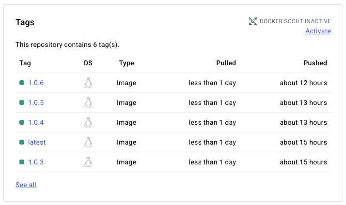

Public image available for K8s to pull.

## Minikube Deploy & Test

**Service type:**

- Minikube ⇒ `NodePort` (or `ClusterIP` + `minikube service`)
- EKS ⇒ `LoadBalancer`

### 1. Start & apply

**Command:**

```bash
minikube start
kubectl create namespace hw2 || true
kubectl -n hw2 apply -f k8s/minikube/
```

### 2. Inspect, get URL, validate

**Command:**

```bash
kubectl -n hw2 get deploy
kubectl -n hw2 get pods
kubectl -n hw2 get svc
kubectl -n hw2 get endpoints

# If type=NodePort or ClusterIP, use Minikube helper to open a tunnel/URL:
minikube service -n hw2 web-svc --url

# Health check via URL printed above
curl -i http://<URL>/health
```

**Screenshots (Minikube):**
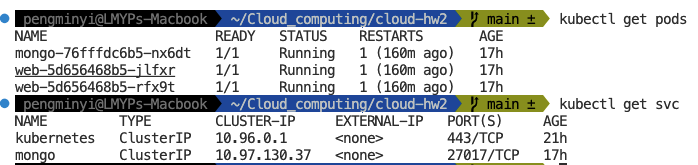

## EKS Deploy & Test

### Create cluster

```bash
export AWS_REGION=us-east-1
export CLUSTER_NAME=hw2-cluster
export K8S_VERSION=1.30

eksctl create cluster \
  --name ${CLUSTER_NAME} \
  --region ${AWS_REGION} \
  --version ${K8S_VERSION} \
  --nodes 2 \
  --node-type t3.medium \
  --managed
```

### Connect cluster & apply manifests

**Command:**

```bash
# Update kubeconfig
aws eks update-kubeconfig --name ${CLUSTER_NAME} --region ${AWS_REGION}

kubectl config current-context
kubectl get nodes

kubectl create namespace hw2 || true
kubectl -n hw2 apply -f k8s/eks/
```

### Inspect & validate public access

**Command:**

```bash
kubectl -n hw2 get deploy -o wide
kubectl -n hw2 get pods -o wide
kubectl -n hw2 get svc -o wide
kubectl -n hw2 get endpoints
kubectl -n hw2 describe svc web-svc
kubectl -n hw2 logs deploy/web --tail=50

# After EXTERNAL-IP/hostname appears:
curl -i http://ab7c0b02b84614543bd2ff1da4969bf3-120652580.us-east-1.elb.amazonaws.com/healthz
```

**Screenshots (EKS):**
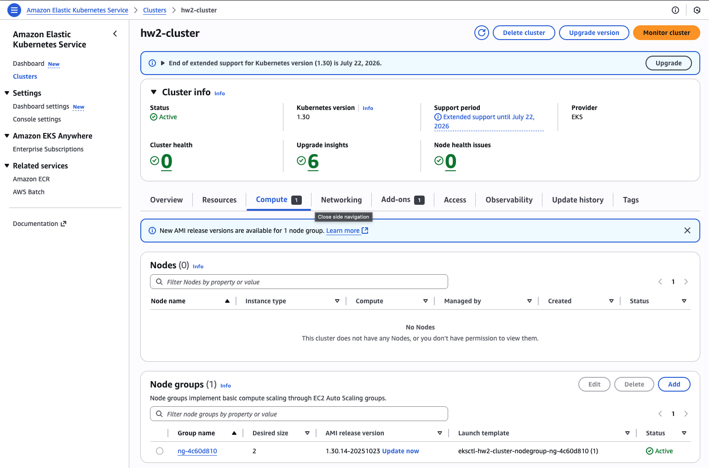
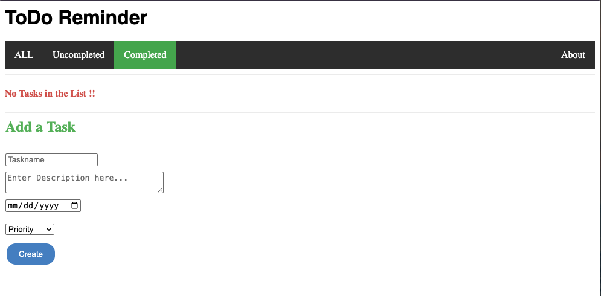
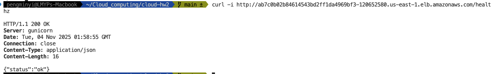
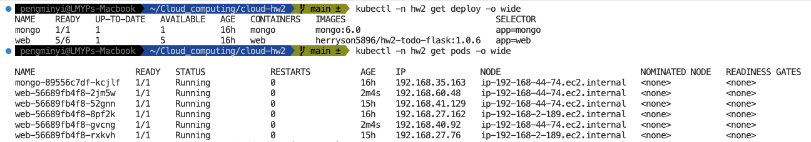
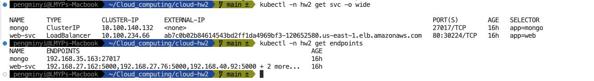

## Deployments & ReplicaSets

1. Set replicas in ```./k8s/eks/deployment.yaml```, apply, and verify ReplicaSets.
2. Manually delete one Pod and observe self-healing.
3. Practice horizontal scaling with kubectl scale or YAML edits.

### Apply and verify:

**Command:**

```bash
kubectl -n hw2 apply -f k8s/eks/deployment.yaml
kubectl -n hw2 get deploy -o wide
kubectl -n hw2 get rs -o wide -l app=web
kubectl -n hw2 get pods -o wide -l app=web
```

**Delete one Pod → Kubernetes auto-recreates**

Pick any web Pod and delete it:

```bash
kubectl -n hw2 delete pod "$POD"
kubectl -n hw2 get pods -w -l app=web
```

**Horizontal scaling**

```bash
kubectl -n hw2 scale deploy/web --replicas=5
kubectl -n hw2 get deploy web
kubectl -n hw2 get pods -l app=web -o wide
```

**Screenshots:**
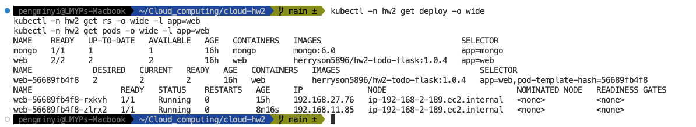
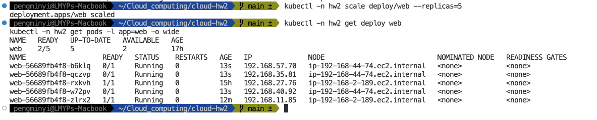

## Rolling Update
Configure a RollingUpdate strategy, bump the image tag, watch rollout progress, verify new version

In ```k8s/eks/deployment.yaml```:

```bash
spec:
  strategy:
    type: RollingUpdate
    rollingUpdate:
      maxUnavailable: 25%   # at most 25% of Pods can be unavailable during update
      maxSurge: 25%         # temporarily create up to 25% extra Pods during update
```

Apply and confirm:

```bash
kubectl -n hw2 apply -f k8s/eks/deployment.yaml
kubectl -n hw2 describe deploy/web | sed -n '1,120p' | sed -n '/Strategy/,/Selector/p'
```

Trigger a rollout
```bash
# Example: bump from :1.0.X to :1.0.X
kubectl -n hw2 set image deploy/web web=herryson5896/hw2-todo-flask:1.0.6 --record
kubectl -n hw2 rollout status deploy/web
kubectl -n hw2 get rs -o wide -l app=web
```

**Screenshots:**
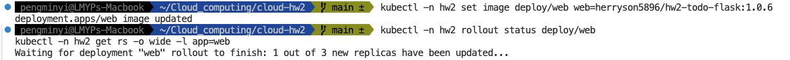

## Health monitoring (Probes)

Add readinessProbe and livenessProbe, observe behavior, simulate failures, and see Kubernetes reaction

In ```k8s/eks/deployment.yaml```

```bash
livenessProbe:
            httpGet: { path: /healthz, port: 5000 }
            initialDelaySeconds: 10
            periodSeconds: 10
            timeoutSeconds: 2
            failureThreshold: 3
          readinessProbe:
            httpGet: { path: /readyz, port: 5000 }
            initialDelaySeconds: 10
            periodSeconds: 5
            timeoutSeconds: 2
            failureThreshold: 3
```

Apply & verify:

```bash
kubectl -n hw2 apply -f k8s/eks/deployment.yaml
kubectl -n hw2 get pods -l app=web -w
kubectl -n hw2 describe pod $(kubectl -n hw2 get pod -l app=web -o jsonpath='{.items[0].metadata.name}') | sed -n '/Events/,$p'
```

**Liveness probe test**

To test the liveness probe, we temporarily changed the liveness HTTP path from its valid endpoint to an invalid path (/brokenpath) using kubectl patch. Kubernetes repeatedly received non-200 responses from the liveness probe, marked the container as unhealthy, and restarted it automatically. The RESTARTS counter increased, confirming that the liveness probe and the platform’s self-healing behavior work correctly. After the test, we restored the original probe path to return the Pod to a healthy state.

```bash
# Set variables
NS=hw2
DEP=web

# Break liveness: point to a non-existent path
kubectl -n "$NS" patch deploy "$DEP" --type='json' \
  -p='[
    {"op":"replace","path":"/spec/template/spec/containers/0/livenessProbe/httpGet/path","value":"/brokenpath"}
  ]'
kubectl -n "$NS" rollout status deploy/"$DEP"

# Observe restarts increasing
kubectl -n "$NS" get pods -l app=web -w

# Show events mentioning liveness failures (take a screenshot)
POD=$(kubectl -n "$NS" get pod -l app=web -o jsonpath='{.items[0].metadata.name}')
kubectl -n "$NS" describe pod "$POD" | sed -n '/Events/,$p'

# Restore liveness path
kubectl -n "$NS" patch deploy "$DEP" --type='json' \
  -p="[ {\"op\":\"replace\",\"path\":\"/spec/template/spec/containers/0/livenessProbe/httpGet/path\",\"value\":\"${ORIG_LIVENESS:-/health}\"} ]"
kubectl -n "$NS" rollout status deploy/"$DEP"
```

**Screenshots:**
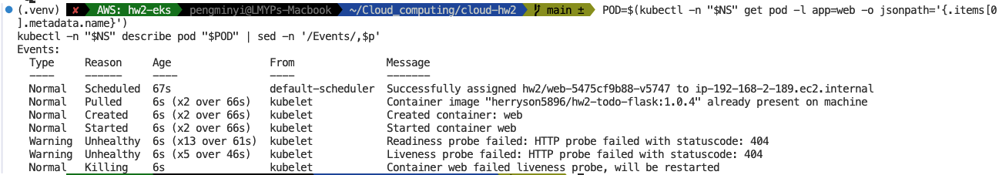

**Readiness probe test**

To verify the readiness probe, we changed the readiness HTTP path to an invalid endpoint (/brokenpath). Kubernetes marked the Pod as NotReady (0/1) without restarting it, and the Pod was removed from the Service endpoints. This demonstrates that readiness controls traffic admission rather than container lifecycle. After restoring the original path, the Pod returned to 1/1 Ready and resumed serving traffic.

```bash
# Break readiness: point to a non-existent path
kubectl -n "$NS" patch deploy "$DEP" --type='json' \
  -p='[
    {"op":"replace","path":"/spec/template/spec/containers/0/readinessProbe/httpGet/path","value":"/brokenpath"}
  ]'
kubectl -n "$NS" rollout status deploy/"$DEP"

#show probe failures in events
POD=$(kubectl -n "$NS" get pod -l app=web -o jsonpath='{.items[0].metadata.name}')
kubectl -n "$NS" describe pod "$POD" | sed -n '/Events/,$p'

# Restore readiness path
kubectl -n "$NS" patch deploy "$DEP" --type='json' \
  -p="[ {\"op\":\"replace\",\"path\":\"/spec/template/spec/containers/0/readinessProbe/httpGet/path\",\"value\":\"${ORIG_READINESS:-/health}\"} ]"
kubectl -n "$NS" rollout status deploy/"$DEP"
```

**Screenshots:**

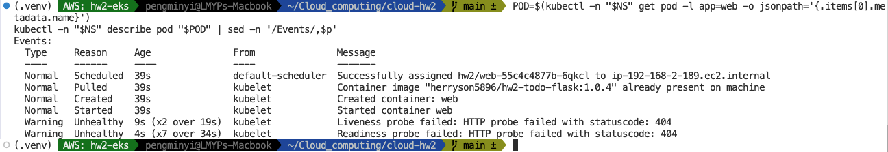

## Alerting (Prometheus + Slack)

Install kube-prometheus-stack

```bash
helm repo add prometheus-community https://prometheus-community.github.io/helm-charts
helm repo update
kubectl create namespace monitoring || true
```
Set variables:

```bash
export SLACK_WEBHOOK_URL='https://hooks.slack.com/services/.../.../...'
export SLACK_CHANNEL='#hw2-alerts'
```

In ```./values-alerts.yaml```
```bash
alertmanager:
  config: |
    route:
      receiver: 'slack'
      group_by: ['alertname','namespace']
      group_wait: 10s
      group_interval: 1m
      repeat_interval: 30m
    receivers:
    - name: 'slack'
      slack_configs:
      - api_url: ${SLACK_WEBHOOK_URL}
        channel: '${SLACK_CHANNEL}'
        send_resolved: true
        title: "[{{ .Status | toUpper }}] {{ .CommonLabels.alertname }} ({{ .CommonLabels.severity }})"
        text: >-
          *Namespace:* {{ .CommonLabels.namespace }}
          *Summary:* {{ .CommonAnnotations.summary }}
          *Desc:* {{ .CommonAnnotations.description }}
```

Install:

```bash
helm install kps prometheus-community/kube-prometheus-stack -n monitoring -f values-alerts.yaml
kubectl -n monitoring get pods
```

Add custom alert rules:
```bash
cat <<'YAML' | kubectl apply -f -
apiVersion: monitoring.coreos.com/v1
kind: PrometheusRule
metadata:
  name: hw2-custom-alerts
  namespace: monitoring
  labels:
    release: kps
spec:
  groups:
  - name: hw2.web.rules
    rules:
    # [FIRING] WebPodNotReady (warning)
    # Namespace: hw2
    # Summary: web pod not ready
    # Desc: Pod <pod-name> in hw2 is not Ready for > 30s.
    - alert: WebPodNotReady
      expr: max by (pod,namespace) (kube_pod_container_status_ready{namespace="hw2", container="web"} == 0)
      for: 30s
      labels:
        severity: warning
      annotations:
        summary: "web pod not ready"
        description: "Pod {{ $labels.pod }} in {{ $labels.namespace }} is not Ready for > 30s."

    - alert: WebPodRestartBurst
      expr: increase(kube_pod_container_status_restarts_total{namespace="hw2", pod=~"web-.*"}[5m]) > 2
      for: 0m
      labels:
        severity: critical
      annotations:
        summary: "web container restarts spike"
        description: "Pod {{ $labels.pod }} restarted > 2 times in 5m."

    - alert: WebDeploymentAvailableReplicasShortage
      expr: |
        kube_deployment_status_replicas_available{namespace="hw2",deployment="web"}
        < kube_deployment_spec_replicas{namespace="hw2",deployment="web"}
      for: 2m
      labels:
        severity: warning
      annotations:
        summary: "web deployment available replicas < desired"
        description: "Available replicas below spec for > 2m in {{ $labels.namespace }}."
YAML

```

Test: Stop Mongo
```bash
kubectl -n hw2 scale deploy/mongo --replicas=0
kubectl -n hw2 get pods -l app=web -w
# for: 30s → Slack receives WebPodNotReady
kubectl -n hw2 scale deploy/mongo --replicas=1

```

**Screenshots:**
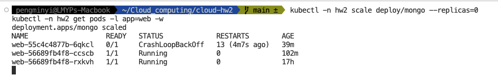
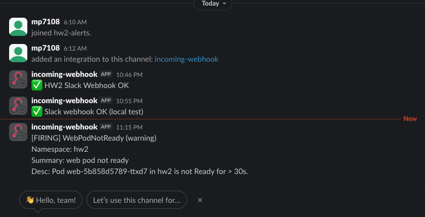
